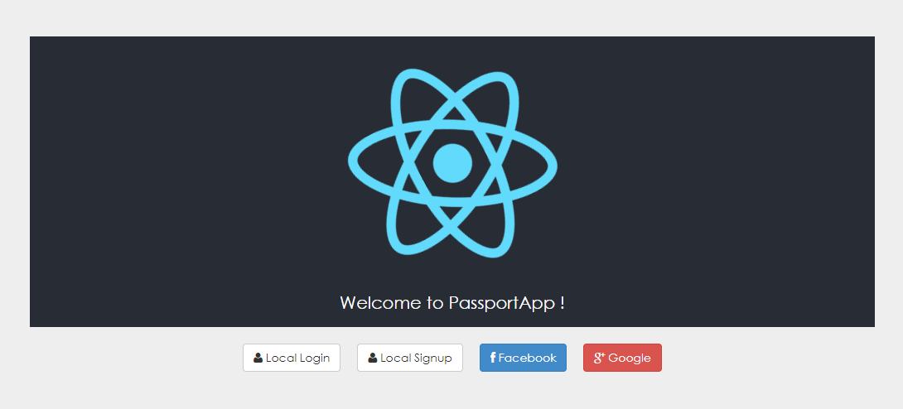

# Passport App

This is a MERN (Mongo, Express, React, Node) stack application which put forward several types of authentication strategy (Local, JWT, Facebook, Google) using Passport JS.

## Commands to run the application

In the project directory, you can

* Use [npm](https://nodejs.org/en/download/) package manager:

```bash
# First, run the backend
cd back/
npm install
npm start
# Then, run the frontend
cd front/
npm install
npm start
```

* Use [Docker](https://docs.docker.com/docker-for-windows/install/) :

```bash
docker-compose build
docker-compose up
```

Open [http://localhost:3000](http://localhost:3000) to view it in the browser.

## Technologies

* React
* Node JS (Express JS)
* [Passport JS](http://www.passportjs.org/)
* Mongo DB
* [Docker](https://docs.docker.com/docker-for-windows/install/)

## Enable Facebook and Google Authentication

To obtain your API ID for Facebook and Google, please create a project on the two following links :

* [Facebook for developpers](https://developers.facebook.com/)
* [Google Cloud Platform](https://cloud.google.com/)

Then, define a .env file on the __back__ folder like this :

```bash
# Facebook ID
FACEBOOK_CLIENT_ID=
FACEBOOK_CLIENT_SECRET=
FACEBOOK_CALLBACK_URL=http://localhost:8000/auth/facebook/callback
# Google ID
GOOGLE_CLIENT_ID=
GOOGLE_CLIENT_SECRET=
GOOGLE_CALLBACK_URL=http://localhost:8000/auth/google/callback
```

## Additionnal informations

Defaults ports :

    Frontend : 3000
    Backend : 8000

You can also put some variables informations on the .env file :

```bash
# Back-end informations
TITLE=MyApp
SERVER_PORT=8000
NODE_ENV=production
# Mongo DB url
MONGODB_URL=mongodb://localhost:27017/passport-app
# JWT secret key
JWT_KEY=<my_secret_key>
```
## Screenshots

